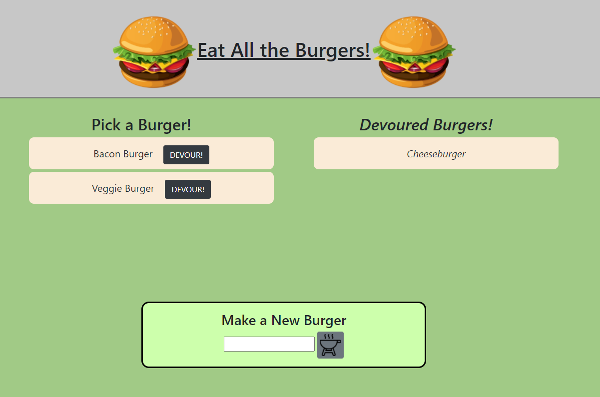
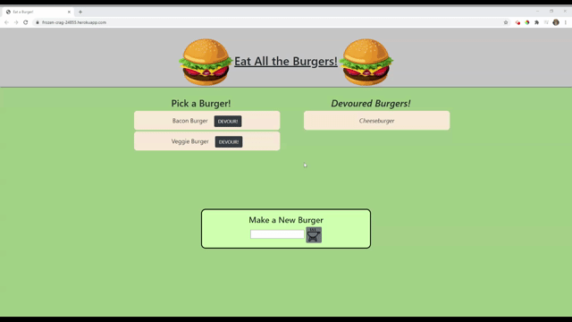

# Burger

Keep track of all the burgers you want to try and all the burgers you have DEVOURED!

## Table of Contents

1. [Usage](#Usage)
1. [Languages and Concepts](#Languages-and-Concepts)
1. [Demo](#Demo)
1. [Roadmap](#Roadmap)
1. [Links](#Links)
1. [Contact](#Contact)
1. [Contributing](#Contributing)
1. [License](#License)

## Usage

Using this application, you can make a list of all the burgers you would like to try and then once you have, mark them as DEVOURED! and they'll be stored in a different list.

## Languages and Concepts

- [MySql](https://www.npmjs.com/package/mysql)
- [Node.js](https://nodejs.org/en/)
- [Express.js](https://expressjs.com/)
- [Handlebars.js](https://handlebarsjs.com/)

## Demo

## Roadmap

To further this project, I would like to incorporate messages that pop up when a burger is added and when a burger is devoured to add to it visually and make it a little more interactive for the user. I would also want to add validations to make sure the input box isn't empty or numbers. I would like to take this app more towards the consumer by making a restaurant tracker app where the user can keep track of what they've tried at different restaurants, what they'd like to try when they come back (in case they want to stick with the usual, but want to try that new plate next time) and a rating system so they remember what they liked and didn't like. I would also like to incorporate more menu items to choose from as well.

## Links

- [See it live](https://frozen-crag-24855.herokuapp.com/)
- [Project Repository](https://github.com/ncmarsh/burger)

## Contact

- Nicole Marshall - [@ncmarsh](https://github.com/ncmarsh)

## Contributing

This is a personal project; no contributions are required at this time.

## License

No license granted.

##### [Return to Top of Page](#Burger)